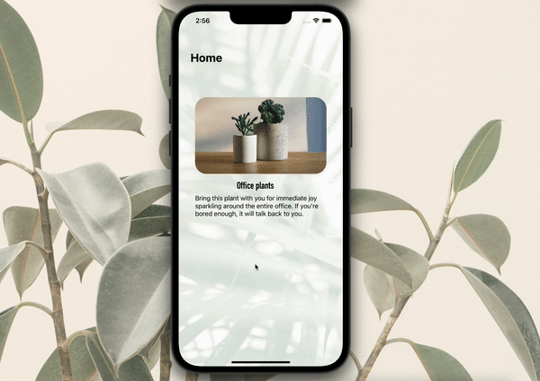

# Nice side menu concept for Swift

 

A more creative way to present a side menu on iOS.

Tutorial:  
– [Medium](https://betterprogramming.pub/how-to-make-a-nice-side-menu-for-your-ios-app-using-swift-5-8868adafbee0)  
– [Youtube](https://www.youtube.com/watch?v=fV6V4R-Fvjs&t=5s)
